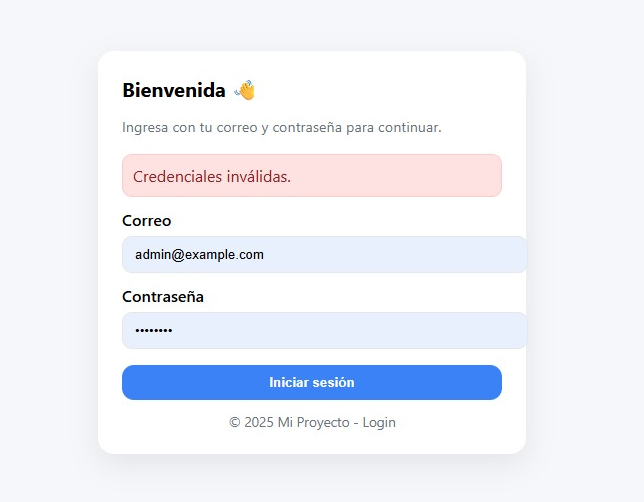

# 🧪 QA Report – Proyecto en InfinityFree

**Fecha:** 26/09/2025  
**Versión probada:** 1.0.0

## 📝 Resumen de pruebas

| Caso                                      | Resultado esperado                                   | Resultado obtenido | Estado   |
|--------------------------------------------|-----------------------------------------------------|--------------------|----------|
| Campo email vacío                          | Mensaje de error                                    | Correcto           | ✅       |
| Email inválido                             | No guarda en BD, alerta credenciales inválidas      | Correcto           | ✅       |
| Inyección SQL                              | No inserta ni rompe consulta                        | Correcto           | ✅       |
| Contraseña almacenada en BD                | Hash en vez de texto plano                          | Correcto           | ✅       |
| Insertar registro válido                   | Guarda y aparece en listar.php                      | Correcto           | ✅       |
| Exportar CSV                               | Descarga archivo con registros                      | En desarrollo      | 🚧       |
| Login correcto                             | Acceso permitido                                    | Correcto           | ✅       |
| Login incorrecto                           | Acceso denegado                                     | Correcto           | ✅       |

---

## 📋 Pruebas realizadas

### 1. Validación de formularios
- Caso: Campo email vacío  
- Resultado esperado: mensaje de error, debe completar este campo. 
- Resultado obtenido: mensaje de error, debe completar este campo. 
- **Pasos para reproducir:**  
  1. Dejar el campo email vacío en el formulario  
  2. Enviar el formulario  

 

---

- Caso: Email inválido (ej: "abc123")  
- Resultado esperado: no se guarda en BD, verifica que las credenciales son invalidas 
- Resultado obtenido: 
- **Pasos para reproducir:**  
  1. Ingresar un email inválido  
  2. Enviar el formulario  

Al iniciar sesión con credenciales incorrectas

Se generá el siguiente mensaje de alerta indicando que las credenciales son invalidas. 

  

---

### 2. Seguridad
- Caso: Intento de inyección SQL (`' OR 1=1 --`)  
- Resultado esperado: no insertar ni romper consulta  
- Resultado obtenido: 
- **Pasos para reproducir:**  
  1. Ingresar el payload en el campo correspondiente  
  2. Enviar el formulario 

 

- Caso: Contraseña almacenada en BD  
- Resultado esperado: hash en vez de texto plano  
- Resultado obtenido: Se evidencia que el campo password tiene hash

 

---

### 3. Funcionalidad
- Caso: Insertar registro válido  
- Resultado esperado: se guarda en la BD y aparece en `listar.php`  
- Resultado obtenido: 
- **Pasos para reproducir:**  
  1. Iniciar Sesion 
  2. Seleccionar la opción "registrar nuevo usuario".  
  2. Diligenciar todos los campos del formulario de registro. 
  4. Seleccionar la opción "ver usuarios registrados".

 

 Formulario de registro

 

 A continuación la captura de pantalla de listar usuarios registrados. 

 

- Caso: Exportar CSV  
- Resultado esperado: descarga archivo con registros  
- Resultado obtenido: actualmente la funcionalidad se encuentra en proceso de desarrollo...

 

---

### 4. Login (si aplica)
- Caso: Usuario/contraseña correcta  
- Resultado esperado: acceso permitido  
- Resultado obtenido: 
- **Pasos para reproducir:**  
  1. Iniciar Sesion con las credenciales correctas.

 

  

- Caso: Usuario/contraseña incorrecta  
- Resultado esperado: acceso denegado  
- Resultado obtenido: 
- **Pasos para reproducir:**  
  1. Iniciar Sesion con las credenciales incorrectas.

 

---

## ✅ Conclusiones QA
- [Breve conclusión del tester: ¿funciona correctamente? ¿qué falta por corregir?]

La aplicación presenta un comportamiento seguro y funcional en las pruebas realizadas:
- ✅ Validaciones de formulario funcionan correctamente
- ✅ Sistema resistente a inyecciones SQL básicas  
- ✅ Autenticación funciona según lo esperado
- ✅ Registrar usuarios nuevos funciona según lo esperado
- ✅ Listar usuarios funciona según lo esperado

**Estado general**: ACEPTABLE para producción POC con funcionalidades básicas. 
**Recomendaciones**: Realizar pruebas adicionales con mayor volumen de datos.