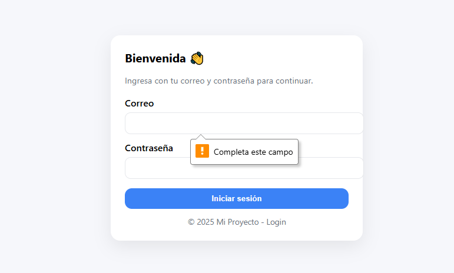
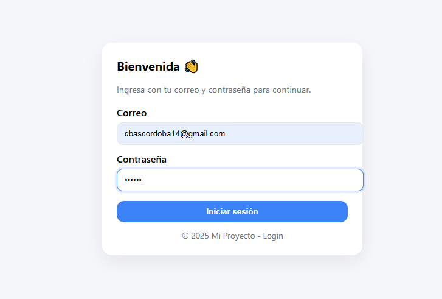
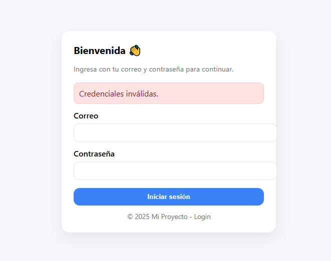
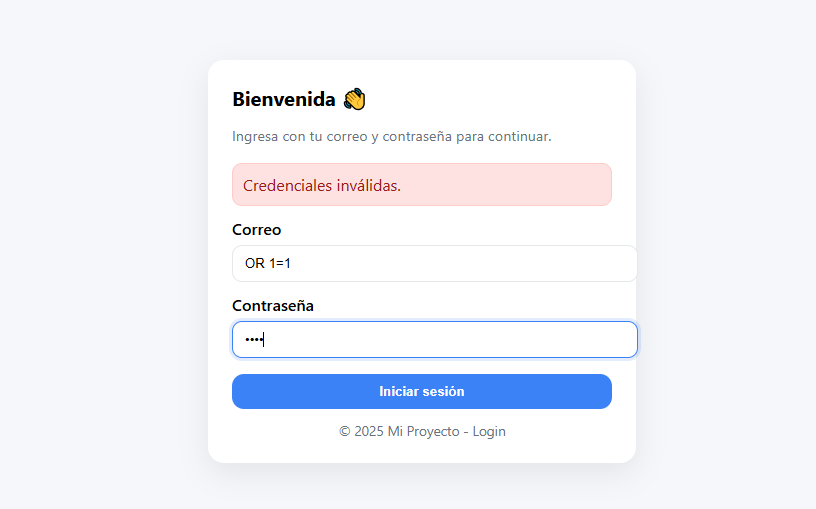
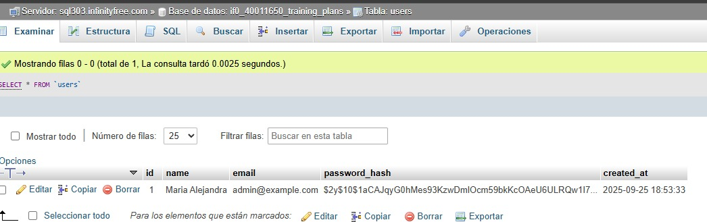
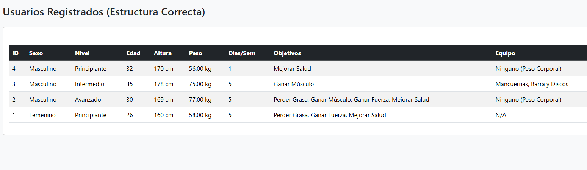
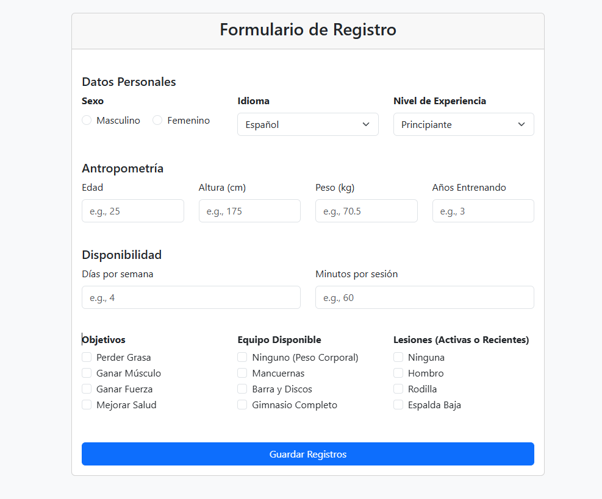

# 🧪 QA Report – Proyecto en InfinityFree

## 📋 Pruebas realizadas

### 1. Validación de formularios
- Caso: Campo email vacío  
- Resultado esperado: mensaje de error, debe completar este campo. 
- Resultado obtenido:

 

---

- Caso: Email inválido (ej: "abc123")  
- Resultado esperado: no se guarda en BD, verifica que las credenciales son invalidas 
- Resultado obtenido: 

Al iniciar sesión con credenciales incorrectas

 

 Se generá el siguiente mensaje de alerta indicando que las credenciales son invalidas. 

  

---

### 2. Seguridad
- Caso: Intento de inyección SQL (`' OR 1=1 --`)  
- Resultado esperado: no insertar ni romper consulta  
- Resultado obtenido: 

 

- Caso: Contraseña almacenada en BD  
- Resultado esperado: hash en vez de texto plano  
- Resultado obtenido: 

 

---

### 3. Funcionalidad
- Caso: Insertar registro válido  
- Resultado esperado: se guarda en la BD y aparece en `listar.php`  
- Resultado obtenido: 

 

 

- Caso: Exportar CSV  
- Resultado esperado: descarga archivo con registros  
- Resultado obtenido: 

 

---

### 4. Login (si aplica)
- Caso: Usuario/contraseña correcta  
- Resultado esperado: acceso permitido  
- Resultado obtenido: 

 

  

- Caso: Usuario/contraseña incorrecta  
- Resultado esperado: acceso denegado  
- Resultado obtenido: 

 

---

## ✅ Conclusiones QA
- [Breve conclusión del tester: ¿funciona correctamente? ¿qué falta por corregir?]

La aplicación presenta un comportamiento seguro y funcional en las pruebas realizadas:
- ✅ Validaciones de formulario funcionan correctamente
- ✅ Sistema resistente a inyecciones SQL básicas  
- ✅ Autenticación funciona según lo esperado

**Estado general**: ACEPTABLE para producción POC con funcionalidades básicas. 
**Recomendaciones**: Realizar pruebas adicionales con mayor volumen de datos.